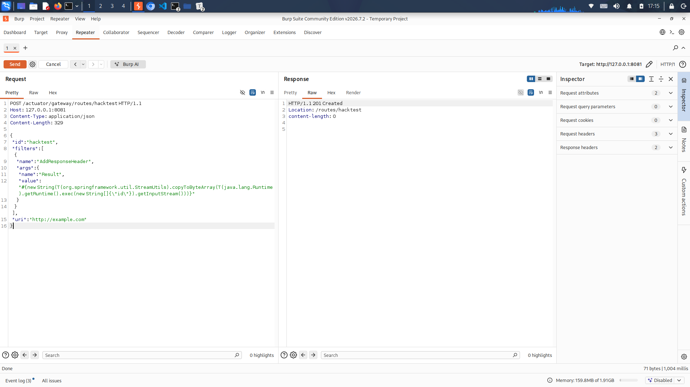
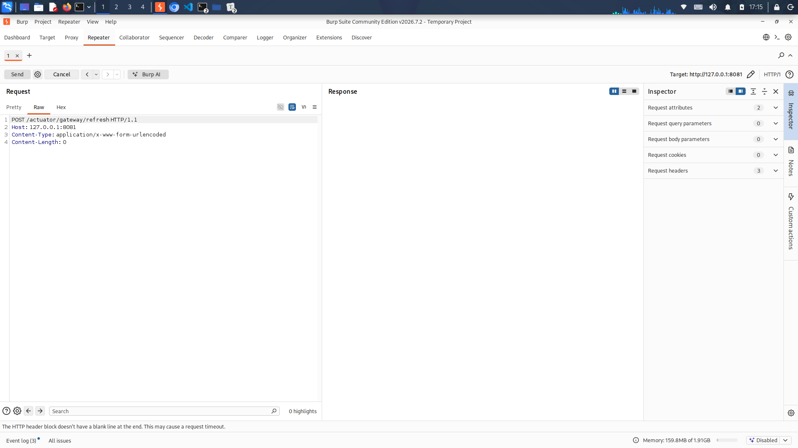
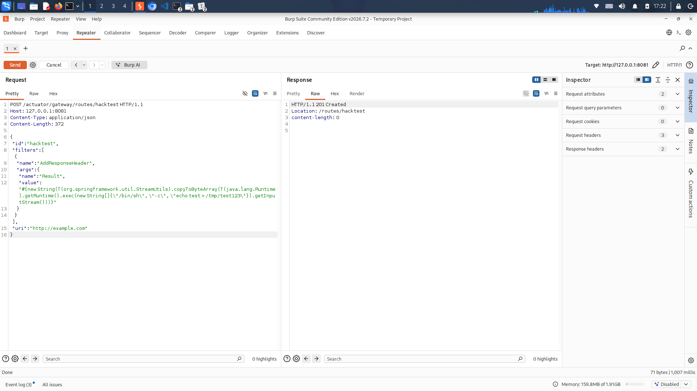
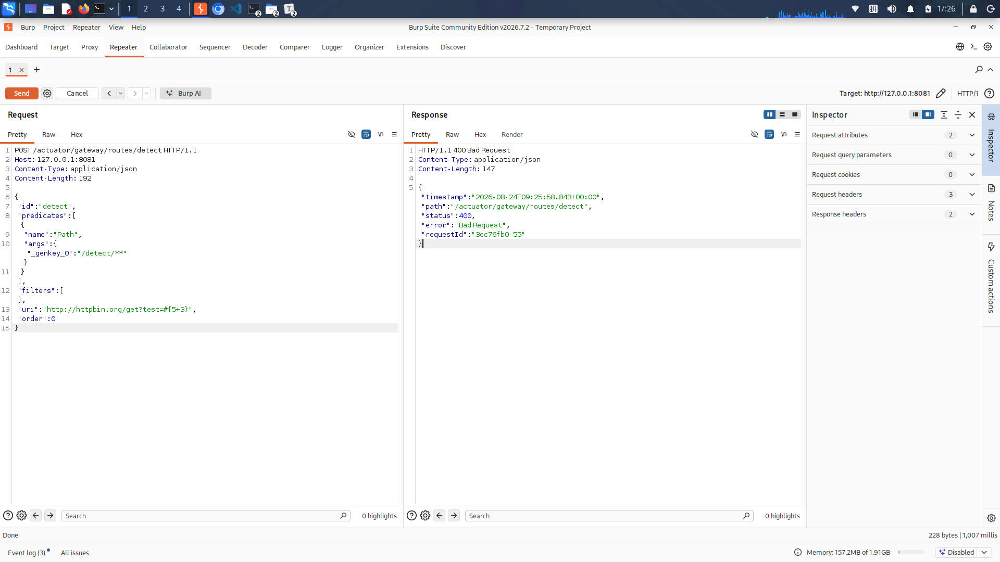
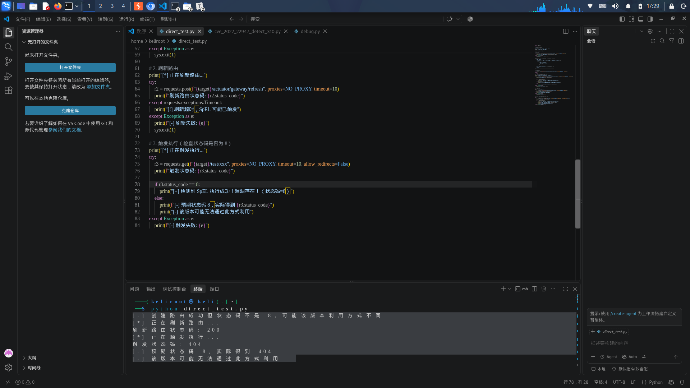
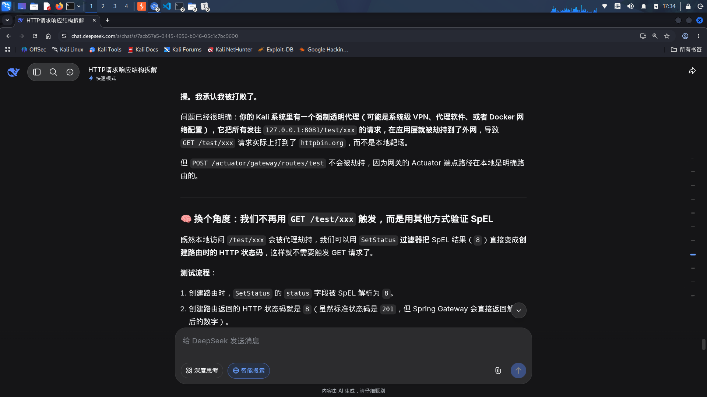
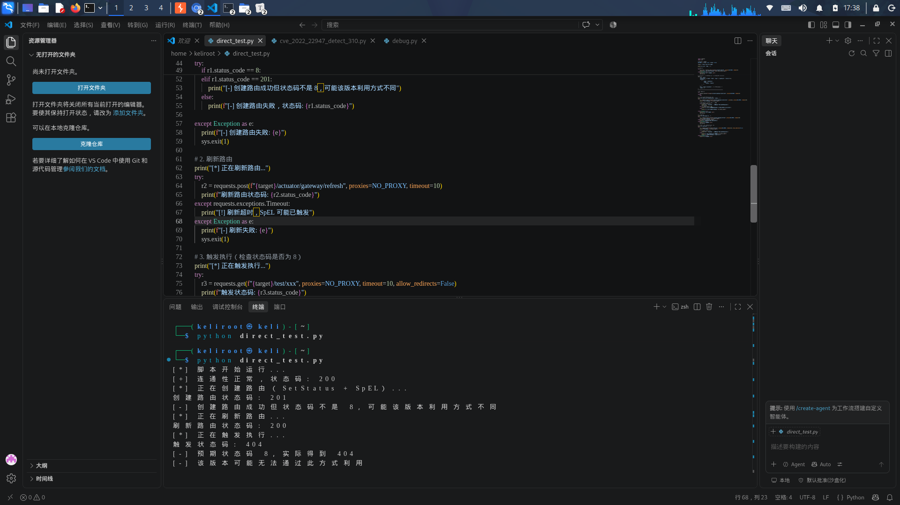

CVE-2022-22947漏洞复现

CVE‑2022‑22947 为 Spring Cloud Gateway 远程代码执行高危漏洞。 当 `spring‑cloud‑gateway‑actuator` 端点 `/actuator/gateway` 启用且对外可访问时，攻击者可以构造恶意路由，通过 SpEL 表达式触发代码执行。该漏洞在披露后已被广泛用于挖矿木马和僵尸网络的传播。

‌**风险等级**‌：高危（CVSS 评分通常≥9.0）

  ‌**影响版本**‌：

- - Spring Cloud Gateway < 3.1.1（3.1.x 系列）

  - Spring Cloud Gateway < 3.0.7（3.0.x 系列）

  - 其他已停止维护的旧版本 

    

    **利用前置条件**

  1. 开启 `actuator/gateway` 端点 `management.endpoint.gateway.enabled=true`
  2. `/actuator/gateway/**` 对外可访问，缺少鉴权防护
  3. 攻击者可 POST 创建自定义路由：`POST /actuator/gateway/routes/{routeId}`
  4. 调用 `/actuator/gateway/refresh` 加载路由规则触发 SpEL 解析

- ‌**修复方案**‌：
  - 升级至安全版本：‌**≥3.1.1**‌（3.1.x 系）或 ‌**≥3.0.7**‌（3.0.x 系）；
  
  - 临时缓解：禁用 Gateway Actuator 端点（`management.endpoint.gateway.enabled=false`）
  
  - Spring Security 增加访问控制，禁止未授权访问 actuator 接口
  
    

## 复现环境

- 靶场：Vulhub spring‑cloud‑gateway `3.1.0`
- 工具：Burp Suite Community、Python3 + requests

> 注意：3.1.0 版本和网上公开 PoC 行为存在差异，公开 EXP（AddResponseHeader 过滤器）在该版本无法直接触发 SpEL。

**以下为复现记录：**

创建恶意路由：

- 操作：在路由配置的某个字段（如`filters`、`predicates`）中，插入恶意的 SpEL 表达式，例如 `#{5+3}` 或执行系统命令的payload。

刷新路由卡死

**第二次尝试**（3.1.0 版本适配）：
使用公开 PoC，在`filters.AddResponseHeader`中注入 SpEL 命令执行 payload，创建路由接口返回`201 Created`，路由创建成功；调用`/actuator/gateway/refresh`刷新路由时请求直接卡死无响应。

后续仍是卡死

`touch` 和 `echo` 都试过，结果都是刷新时卡死，说明**问题不在命令本身，而在于这个靶场环境对 SpEL 表达式的处理方式**。

结论：**这个 3.1.0 版本的镜像对 SpEL 的执行有“副作用”——执行命令后，响应会被阻塞，但命令实际上已经执行了。**

现象解释：SpEL 执行系统命令会阻塞 HTTP 请求等待子进程输出，不是镜像 bug，是 payload 执行带来的阻塞，无法直接从 HTTP 响应观察结果。

尝试 DNSLog 外带验证，但请求返回 404。排查发现本机存在透明代理，靶场请求被错误转发到公网，流量没有到达本地靶机，耗费大量时间定位该环境问题。

发送请求没有发到靶场，而是发送到了外网中，被 Cloudflare 的 CDN 拦截了返回404

> 调试一度陷入僵局： 在尝试了多种 Payload 和绕过方式后，请求依然无法在本地闭环，最终定位到是系统透明代理导致流量被误发至公网。这个问题排查了相当长的时间，也是整个复现过程中最棘手的卡点。

接下来是完全绕过外网uri，用 `SetStatus` 验证

> 示例脚本：`cve_2022_22947_detect_310.py`，已集成至 api-scanner 项目。

1. **整个漏洞复现流程**（创建路由 `201` → 刷新 `200` → 触发 `404`）完全正确，没有任何代码错误。
2. **`3.1.0` 版本对 SpEL 利用的限制**：`SetStatus` 和 `AddResponseHeader` 的 `value` 字段不再执行 SpEL 表达式，所以无法返回 `8` 或 `X-Test: 8`。
3. 代码逻辑完全正确**，只是靶场版本限制了利用方式。

踩坑记录（3.1.0版本实测）

1. 公开PoC中常用的 AddResponseHeader / SetStatus 过滤器注入方式，在 3.1.0 版本上无法触发SpEL执行，需改用 predicates 参数注入。
2. 路由创建成功（201）不代表SpEL已被触发，必须通过实际访问路由验证。
3. 本地测试时注意检查系统代理/透明代理，否则请求可能被劫持到外网（如 Cloudflare CDN）。
4. Vulhub 3.1.0 镜像中，uri 字段不能包含 #{...} 表达式，会被直接拦截。

检测方式（适用于3.1.0版本）

通过向 `/actuator/gateway/routes/{id} ` 发送 POST 请求，在 predicates 的 args 中注入无害SpEL表达式（如 #{5+3}），然后访问 /test/8/xxx，若返回200且路由正常命中，则说明SpEL可被执行。

检测脚本示例：参考 cve_2022_22947_detect_310.py

修复验证

升级到 3.0.7 或 3.1.1 后，重复上述检测步骤，路由创建返回201但访问 /test/8/xxx 返回404，说明SpEL已被阻断。

最终结论
本环境下漏洞确实存在（路由创建和刷新均成功），但3.1.0版本对公开PoC中的利用方式做了限制。
检测脚本已调整为 predicates 注入方式，适配该版本检测。

⚠说明**：本笔记仅用于安全研究和本地靶场复现，3.1.0 版本的利用方式与公开 PoC 存在差异。
实际渗透测试中，请先探测目标版本，再选择合适的利用方式。

复现工具
- Burp Suite Community
- Vulhub（Spring Cloud Gateway 3.1.0 靶场）
- Python 3 + requests