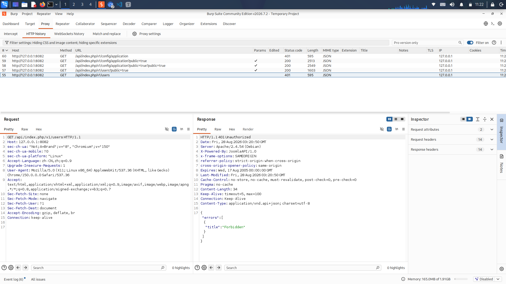
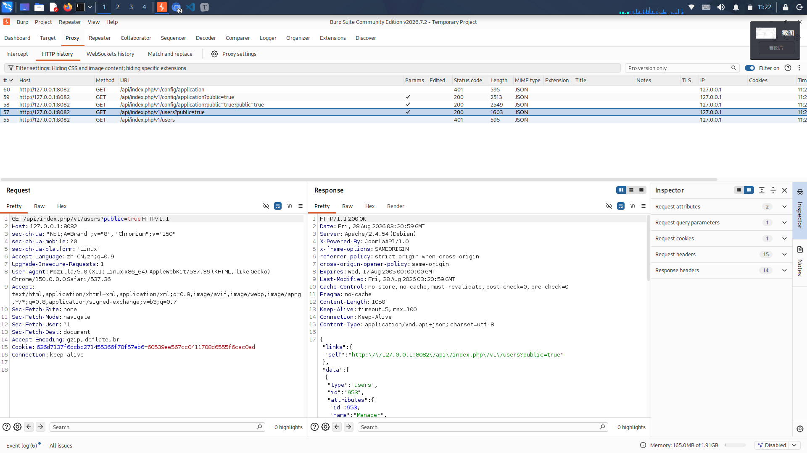
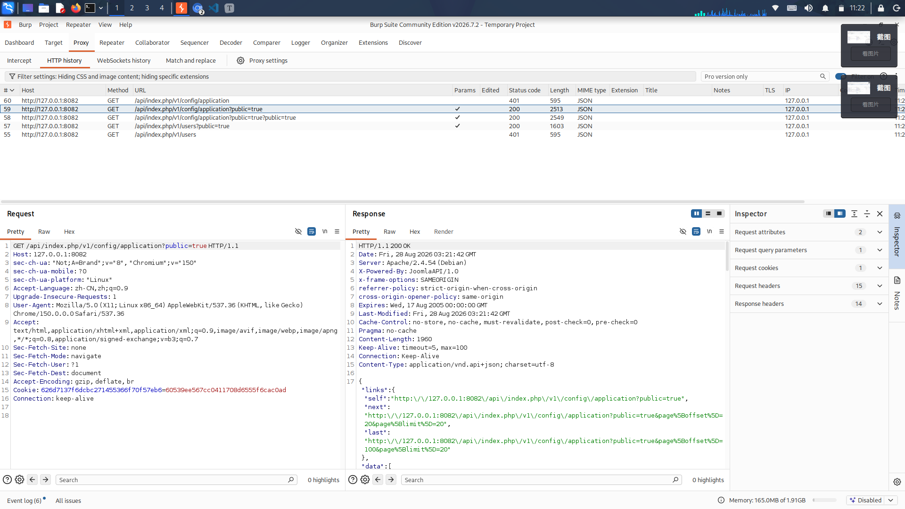
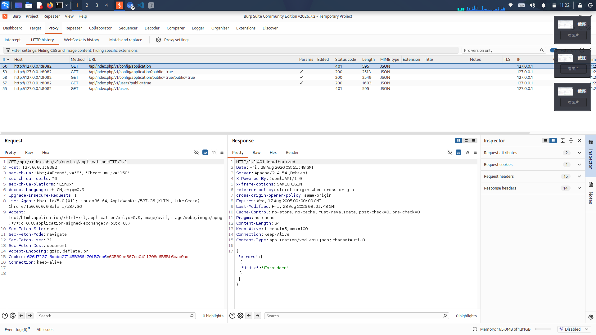

###  CVE-2023-23752漏洞复现

CVE-2023-23752 是 ‌**Joomla**‌ CMS 的一个‌**未授权访问漏洞**‌（高危），于 2023 年 2 月由官方披露，CVSS 评分为 ‌**7.5**‌。‌‌

### 漏洞详情

- ‌**漏洞类型**‌：不安全的 API 访问控制（越权访问），部分描述也归类为路径遍历。

- ‌**影响版本**‌：‌**Joomla 4.0.0 至 4.2.7**‌。

- ‌**成因**‌：Joomla API 接口默认需要登录鉴权，但代码中对 `public=true` 参数**信任过度**，直接强制设置接口为公开模式，**跳过所有权限校验**。

- ‌**危害**‌：可获取‌**数据库账号密码**‌、加密密钥、用户信息（用户名、邮箱、密码哈希）等敏感数据，进而可能被用于进一步入侵。‌‌

     攻击者成功利用后可获取以下敏感信息，并进一步扩大攻击面：

  - 获取数据库账号密码 → 直接连接数据库拖库
  - 获取管理员密码哈希 → 离线破解或碰撞登录后台
  - 获取站点加密密钥 → 可能解密站点敏感数据
  - 获取用户邮箱列表 → 用于钓鱼或撞库攻击

### 主要受影响端点

- `/api/index.php/v1/config/application?public=true` — 泄露数据库凭证、加密密钥

- `/api/index.php/v1/users?public=true` — 泄露用户名、邮箱、密码哈希

- `/api/index.php/v1/content/articles` — 泄露文章内容及元数据

- `/api/index.php/v1/extensions` — 泄露已安装插件列表‌‌

  

### 修复建议

- ‌**升级版本**‌：官方已在 ‌**Joomla 4.2.8**‌ 中修复，请立即升级至 4.2.8 或更高版本。

- ‌**临时缓解**‌：在服务器层面对 `/api/index.php` 端点进行访问限制，并启用 WAF 拦截恶意请求。‌‌

  

**漏洞前置条件**：目标站点开启了 Joomla 内置的 **Web Services（REST API）** 组件，否则 /api 路径 404，漏洞无法利用。

- 漏洞存在：**200 + 返回完整 JSON 数据**
- 漏洞修复：**401 Unauthorized 拦截**
- 未开启 API：**404 Not Found**

以下为测试端口的相关截图：

/api/index.php/v1/users?public=true  — 泄露用户名、邮箱、密码哈希：

/api/index.php/v1/config/application?public=true  — 泄露数据库凭证、加密密钥：

自动检测脚本在附件srcpts文件夹中。

## 踩坑总结

> 必须带参数 **public=true**，少一个字符都无法绕过鉴权 这是 **未授权访问，无需 Cookie、无需登录** 不属于 RCE，属于高危信息泄露，可作为纵深入侵跳板。
